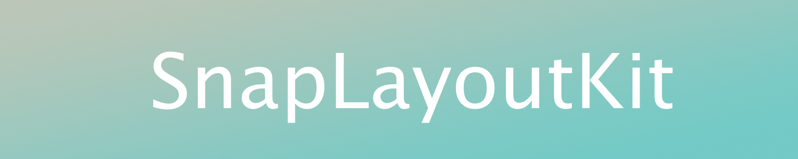

# [](#)
[](https://travis-ci.com/soren1146/SnapLayoutKit)


**SnapLayoutKit** is a lightweight Swift framework (<300 lines) that lets you create _Auto Layout_ constraints programmatically. The framework extends `UIView` with wrapper functions, that does not conflict with your current constraints in the project. The methods are chainable resulting in an ease with setting up your UI.

## Features
- Lightweight and easy to use
- Chainable methods
- Automatically takes care of safe area _(requires iOS 11 or higher)_
- Locale reading direction adaptation

# Why use it?
Lets say we have an UIView we want to center and set a size of. In Apple's method, in order to do this, we will do the following:
**Apple**
```swift
blueView.translatesAutoresizingMaskIntoConstraints = false
NSLayoutConstraint.activate([
    blueView.centerXAnchor.constraint(equalTo: view.centerXAnchor),
    blueView.centerYAnchor.constraint(equalTo: view.centerYAnchor),
    blueView.widthAnchor.constraint(equalToConstant: 100),
    blueView.heightAnchor.constraint(equalToConstant: 100)
])
```

**SnapLayoutKit**
```swift
blueView.exec()
        .center(to: view)
        .size(.init(width: 100, height: 100))
```
The exec() function handles `translatesAutoresizingMaskIntoConstraints`, so there are no need to turn it off manually.

# Requirements
* Xcode
  * Language Support: Swift 5
  * Fully compatible with Xcode 7.0 and higher
* iOS
  * Fully compatible with iOS 11 and higher - _iOS 9 compatible without safearea_

# Installation
## CocoaPods
[CocoaPods](https://cocoapods.org/) is a dependency manager for Cocoa projects. You can install it with the following command:
`gem install cocoapods`
To integrate EasyLayout into your Xcode project, add the following to your `Podfile`:
`pod 'SnapLayoutKit'`

## Carthage
nil

# Usage
To use SnapLayoutKit, the `exec()` **must always be called before any snapping methods**

## Overview
* Uses `NSLayoutAnchor` so the API can be incorporated into every project seamlessly.
* Automatically turns off `translatesAutoresizingMaskIntoConstraints` and activates constraints.
* Can update constraints or simply delete a constraint with a simple method.
* SnapLayoutKit doesn't return a custom object, it only returns familiar UIView objects.
* Chainable methods making it readable and fast to type out.

# Methods
```swift
// Snap Methods
func snap(to view: UIView, inset: UIEdgeInsets = UIEdgeInsets.zero)
func snap(attribute: Attribute, toEdge viewAttribute: Attribute, on view: UIView, offset: CGFloat)
func snapLeft(_ view: UIView, offset: CGFloat)
func snapRight(_ view: UIView, offset: CGFloat)
func snapBottom(_ view: UIView, offset: CGFloat)
func snapTop(_ view: UIView, offset: CGFloat)

// Size Methods
func size(as view: UIView)
func size(_ size: CGSize)

// Centering Methods
func center(to view: UIView)
func centerX(to view: UIView)
func centerY(to view: UIView)

// Updating methods
public func update(constraint constraintAttribute: Attribute, toConstraint updateAttribute: Attribute, on view: UIView, offset: CGFloat)
public func delete(_ attribute: Attribute)
```

# Snapping
```swift
blueView.exec()
        .snap(to: view, inset: .init(top: 5, left: 5, bottom: 5, right: 5))
```
With just these lines of code, the blueView now has 4 constraints filling out `view` with the given inset.

You can also snap only 1 constraint. To do this, the given code is required:
```swift
blueView.exec().snap(attribute: .left, toEdge: .left, on: view, offset: 50)
```
Now the `blueView` has its left side constrained to the `view`'s left side with an offset of 50 points. _The snap method can also be used to size a view or center a view_

# Sizing
SnapLayoutKit makes sizing easy with 2 wrapper methods; `size(as: view) and size(CGSize)`.
Easily make 2 views equal size:
```swift
redView.exec().size(as: blueView)
```
Or make the view has a custom, hardcoded size:
```swift
redView.exec().size(.init(width: 100, height: 100))
```

# Centering
To center a view in another view on both axis, simply use:
```swift
greenView.exec().center(to: blueView)
```
Or if you only want to center to the views X-axis:
```swift
greenView.exec().centerX(to: blueView)
```
The same goes for the Y-axis:
```swift
greenView.exec().centerY(to: blueView)
```

# Updating constraints
To update a left constraint from being bound to `greenView`'s left side to `blueView`'s left side simply use:
```swift
redView.update(constraint: .left, toConstraint: .left, on: blueView, offset: 0)
```
Or you can do it manually with the delete method:
```swift
redView.delete(.left).snap(attribute: .left, toEdge: .left, on: blueView, offset: 0)
```

# Safe area
To constraint a view inside the safearea, simply use `safe()` method before snapping. For example:
```swift
redView.exec().safe().snap(to: view)
```
This makes the red view fill `view` inside the safearea.

# Author
Søren Møller Gade Hansen

# License
SnapLayoutKit is available under the MIT license. See the LICENSE file for more info
